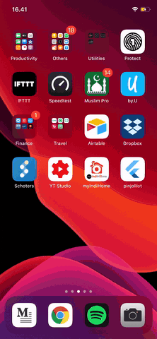

# pinjollist

Pinjollist Flutter application.

#Demo

* [Implementasi BLoC dengan Dio dan Logging Interceptor]()
* [Getting Started to BLoc](https://bloclibrary.dev/)

## Library Used

* [dio](https://pub.dev/packages/dio)
* [flutter_bloc](https://pub.dev/packages/flutter_bloc)
* [equatable](https://pub.dev/packages/equatable)
* [url_launcher](https://pub.dev/packages/url_launcher)
* [build_runner](https://pub.dev/packages/build_runner)
* [json_serializable](https://pub.dev/packages/json_serializable)
